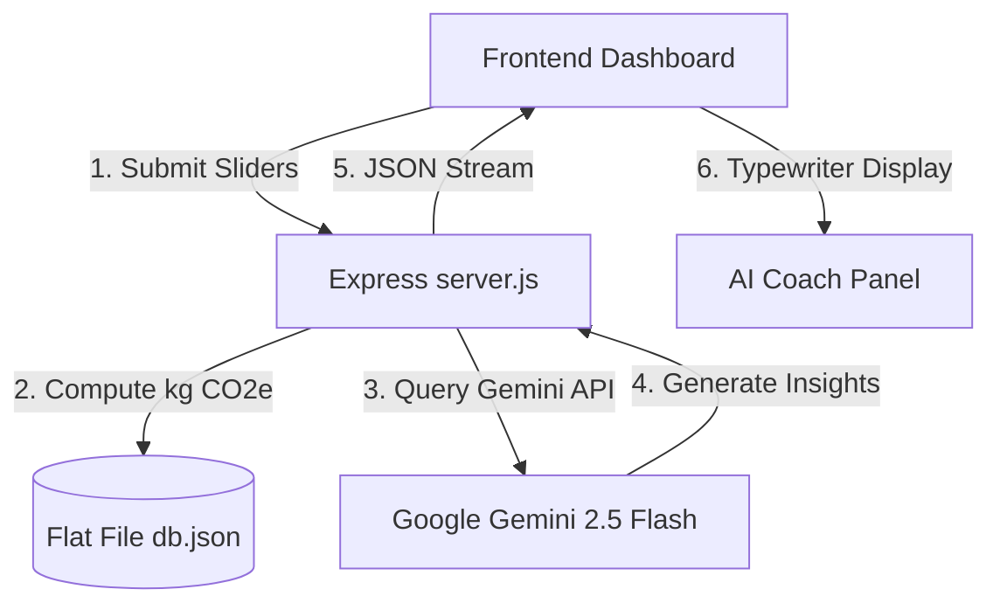

# EcoTrace - Gamified Carbon Footprint Tracker & AI Eco-Coach 🌍🌱

EcoTrace is an interactive Single Page Application (SPA) designed to turn climate action into a fun, daily habit-building routine. The project aligns directly with **United Nations Sustainable Development Goal (SDG) 13: Climate Action** by helping individuals measure, visualize, and reduce their daily carbon emissions.

---

## 🚀 Key Features

* **Interactive Carbon Calculator**: A 4-stage wizard that collects personal transit, home energy, food, and waste details, converting them into concrete carbon output equivalents ($kg\ CO_2e$).
* **AI Eco-Coach (Google Gemini API)**: Analyzes your logged carbon footprint categories in real-time, providing tailored, category-specific lifestyle suggestions.
* **Daily Quests Log**: A checkable task list of sustainable activities (e.g., taking public transport, unplugging electronics) that rewards users with Experience Points (XP) and logs carbon offsets.
* **Live Leaderboards**: Fosters community-led competition by ranking users based on their active streak days and total levels/XP.
* **Visual Analytics**: Interactive category doughnut charts and historical log lines rendered dynamically via Chart.js.
* **Typewriter Effect**: An engaging typing animation displaying the AI Coach's advice in real-time.

---

## 🛠️ Technology Stack

* **Frontend**: HTML5, Vanilla CSS3 (custom glassmorphic theme), JavaScript (ES6+), Chart.js (data visualization), FontAwesome.
* **Backend**: Node.js, Express.js (middleware, REST API routing).
* **Database**: Lightweight JSON File Database (handled via a custom ORM helper `database/db.js`).
* **AI Integration**: Google Gemini 2.5 Flash API via the `@google/genai` library.
* **Auth & Security**: JWT (JSON Web Tokens) and `bcryptjs` password hashing.

---

## 📂 Directory Structure

```plaintext
EcoTrace/
├── database/               # Flat-file database schemas and helpers
│   ├── db.js               # Custom database helper (ORM)
│   └── db.json             # Persisted profiles, logs, quests, and scores
├── public/                 # Static asset distribution
│   ├── css/
│   │   └── style.css       # Custom glassmorphic CSS rules
│   ├── js/
│   │   └── app.js          # SPA Client-side state manager and routing
│   ├── screenshots/        # Project screenshot media
│   └── index.html          # Main HTML entry point
├── .env.example            # Template for environment credentials
├── .gitignore              # Files to ignore in Git
├── package.json            # Node project configuration and dependencies
├── server.js               # Main Express.js backend app
└── README.md               # Project documentation
```

---

## ⚙️ How the System Works (Data Flow)

The application coordinates data between three core layers:



1. **Emission Calculation**: Sliders on the front-end wizard send numeric transit and utility stats to the backend `/api/carbon/log` endpoint. The server calculates carbon output using standard coefficients:
   * **Transit**: $0.21\ kg/km$ (Single commuter car factor).
   * **Energy**: $0.45\ kg/kWh$ (Grid electric average).
   * **Diet**: Carbon values adjusted by food preference (Vegan vs. Meat-heavy).
   * **Waste**: $1.2\ kg/bag$ of general waste.
2. **AI Recommendation**: The calculated category totals are formulated into a context prompt. The backend queries `gemini-2.5-flash` using a system instruction:
   * *Provide 3 brief, actionable carbon reduction ideas. Keep total words under 80.*
   * A local, regex-based safety engine acts as an instant fallback during connectivity issues.
3. **State & Gamification**: User levels, quest completions, and active log streaks are handled in `db.json` and saved on every transaction. XP points are computed by the formula:
   $$\text{XP gained} = (\text{Quest completed} \times 100) + (\text{Streak multiplier})$$

---

## 💻 Local Setup & Installation

### Prerequisites
* [Node.js](https://nodejs.org/) (version 18+ recommended)
* Google Gemini API Key (Generate one via Google AI Studio)

### Steps

1. **Clone the Repository**:
   ```bash
   git clone https://github.com/sarthakghag39-glitch/EcoTrace.git
   cd EcoTrace
   ```

2. **Install Dependencies**:
   ```bash
   npm install
   ```

3. **Configure Environment Variables**:
   Create a `.env` file in the root directory and add the following keys:
   ```env
   PORT=3000
   GEMINI_API_KEY=your_actual_gemini_api_key_here
   JWT_SECRET=some_long_random_string_here
   ```

4. **Launch the Server**:
   ```bash
   npm start
   ```

5. **Open in Browser**:
   Open **[http://localhost:3000](http://localhost:3000)** in Chrome to view the active application.

---

## 📊 Core API Endpoints

* **Authentication**:
  * `POST /api/auth/register` - Registers new eco-citizens.
  * `POST /api/auth/login` - Authorizes users and returns JWT tokens.
* **Carbon Tracking**:
  * `POST /api/carbon/log` - Submits slider wizard answers, records total kg CO2e, and returns AI Coach responses.
  * `GET /api/carbon/history` - Fetches log history lines for Chart.js.
* **Quests & Streaks**:
  * `GET /api/quests` - Fetches active daily quests.
  * `POST /api/quests/complete/:id` - Completes a quest, updates streak days, and awards XP.
* **Leaderboard**:
  * `GET /api/leaderboard` - Lists top users sorted by active XP levels.

---

## 📄 License
This project is developed under the MIT License.
